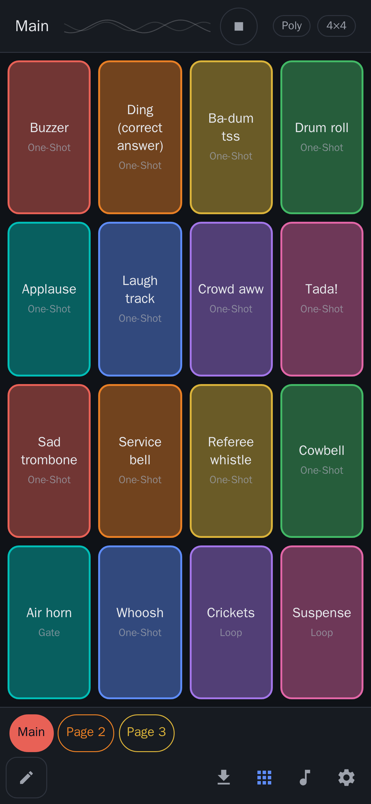
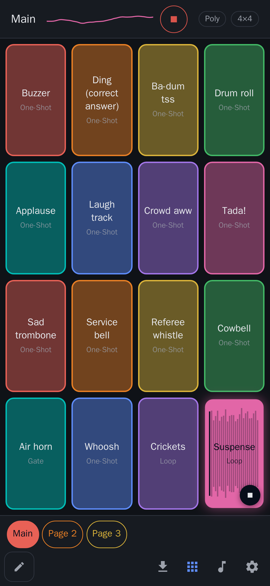
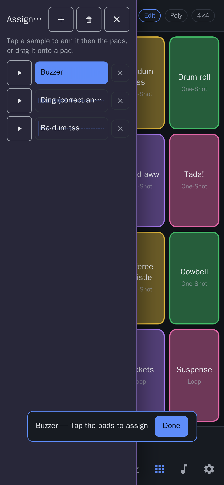
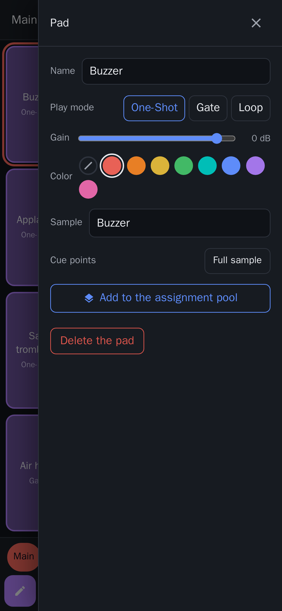
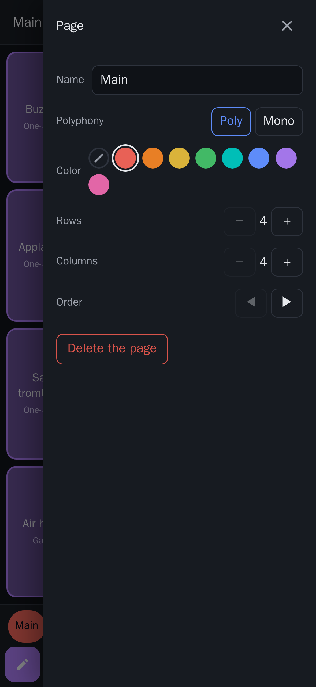
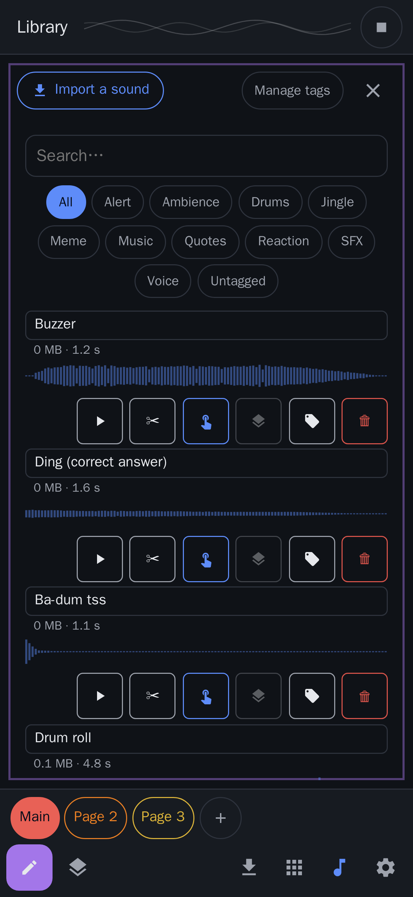
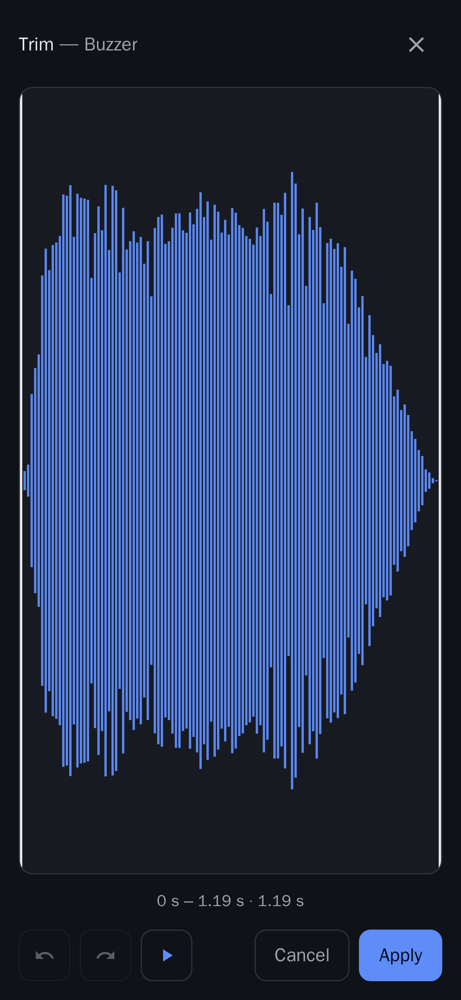
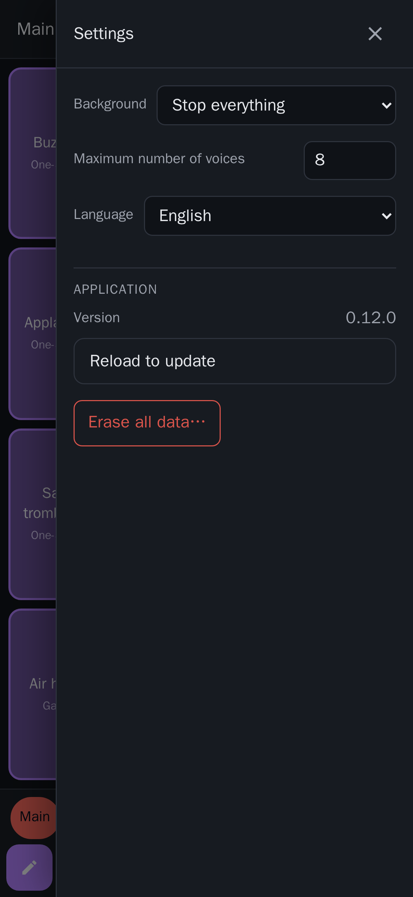

<!-- SPDX-License-Identifier: GPL-3.0-or-later -->
<p align="center">
  
</p>

<h1 align="center">Sampleboard</h1>

<p align="center"><strong>Pads, sounds, zero friction.</strong><br/>
A soundboard app: a grid of pads that trigger your sounds — reactions, jingles,
ambiences — organized in pages. Import your audio, assign, play.<br/>
Built for live moments (streams, tabletop games, radio, workshops), <strong>fully offline</strong>.</p>

<p align="center">
  <a href="https://fchaussin.github.io/sampleboard/"><strong>▶ Try the live demo</strong></a>
</p>

---

It is a *sampleboard*, **not a sampler**: deliberately simple — no effects, no complex
editing, just what you need to fire the right sound at the right time. Runs entirely on your
device — no account, no upload, no telemetry.

## Try it now

**[fchaussin.github.io/sampleboard](https://fchaussin.github.io/sampleboard/)** — runs in your
browser with a 25-sound starter bank, no install. It is an installable **PWA** that keeps
working **fully offline** once loaded.

> On desktop Chrome/Edge, use the *install* icon in the address bar; on Android/iOS, use
> *Add to Home screen*.

## Features

- **Pads in pages**: adjustable grid (up to 6×12), colors, multiple pages.
- **MIDI-controller-style play modes**: **One-Shot** (plays through), **Gate** (while
  pressed), **Loop** (until stopped); **Mono/Poly** polyphony per page.
- **Library**: import your audio files (multi-select, **zip/rar** archives), automatic
  OGG/Opus re-encoding, custom **tags**, search, preview.
- **Assignment pool**: a work tray to arm a sound and drop it onto pads.
- **Trim & cue points**: cut the start/end of a sound, or set a non-destructive playback
  window per pad (waveform, undo/redo) — the original stays untouched.
- **Starter bank**: 25 soundboard classics (buzzer, laugh track, tada, sad trombone,
  applause…), all **CC0** from [Freesound](https://freesound.org).
- **Panic stop**, real-time visualizer, separate Edit and Play modes (no accidental
  triggers on stage).
- **Fully offline**: no network permission, no account, no telemetry.

---

## User guide

A walkthrough of the whole app, screen by screen. Every screenshot below is generated from
the current build.

### 1. The board



This is where you play. Each **pad** is a coloured tile bound to one sound; its **play mode**
(One-Shot / Gate / Loop) is shown under the name. Tap a pad to fire it.

- **Header** — the page name (*Main*), a live **visualizer**, the page **polyphony**
  (*Poly*/*Mono*) and the **grid size** (*4×4*). The header also holds the **Stop all**
  (panic) button, which turns red while anything is playing.
- **Page tabs** (bottom) — switch pages; each page has its own grid and polyphony.
- **Bottom bar** — the **Edit** toggle (pencil), page tabs, **Import**, the **Pads/Library**
  view switch, and **Settings**.

<br clear="all" />

### 2. Playing — the three play modes



Tap a pad to trigger it. Active pads animate a **real-time waveform** and the header
visualizer reacts to the master output.

- **One-Shot** — plays through to the end on a single tap. Stingers, buzzers, jingles.
- **Gate** — plays **only while you hold** the pad, and stops the instant you release.
  (On the starter board, the *Air horn* pad is a Gate — hold to blast.)
- **Loop** — starts on tap and **loops until you stop it** (tap again, or **Stop all**). A
  looping pad shows a small stop control (see *Suspense* here).

**Polyphony** is per page: **Poly** lets several pads ring at once; **Mono** stops the
previous sound when a new pad starts. **Stop all** (top-right) silences everything.

<br clear="all" />

### 3. Assigning sounds — the pool



Enter **Edit** mode (the pencil) to build your board. The **assignment pool** is a small
work tray of sounds:

- Add sounds to it from the **library** or from a pad’s drawer (*Add to the assignment
  pool*).
- **Tap a sound to arm it** (it highlights), then tap the pads that should receive it — great
  for filling several pads fast.
- Or **drag a sound** straight from the pool onto a pad.

<br clear="all" />

### 4. Configuring a pad



In **Edit** mode, tap a pad to open its settings drawer:

- **Name** — the label shown on the pad.
- **Play mode** — **One-Shot**, **Gate** or **Loop**.
- **Gain** — per-pad volume trim, in dB.
- **Color** — pick a tile colour (or *none*) to organize your board.
- **Sample** — the bound library sound; tap to swap it.
- **Cue points** — a non-destructive playback window for this pad (see §7).
- **Add to the assignment pool** — drop this pad’s sound into the pool.
- **Delete the pad** — removes it (the sound stays in your library).

<br clear="all" />

### 5. Pages



Tap the **page name** in the header to open its settings:

- **Rename** the page.
- **Polyphony** — **Mono** or **Poly** for the whole page.
- **Grid** — number of **rows × columns** (up to 6×12).
- **Reorder** or **delete** the page.

Add a page with the **+** tab in Edit mode; switch pages with the tabs at any time.

<br clear="all" />

### 6. The library



Open the **Library** to manage every sound.

- **Import a sound** — add your own audio; multi-select and **zip/rar** archives are
  supported. Files are re-encoded to compact **OGG/Opus** automatically.
- **Search** and **tag filters** (*Alert, Ambience, Jingle, Meme, Music, Quotes, Reaction,
  SFX, Voice…*) narrow a big library fast; **Manage tags** edits the list.
- Each sound shows its **size, duration and waveform**, plus row actions: **preview**,
  **trim**, **assign to a pad**, **add to the pool**, **tag**, **delete**.

<br clear="all" />

### 7. Trimming & cue points



The waveform editor keeps just the part you want. Drag the edges to set **start** and
**end**; the read-out shows the selected window. Use **undo/redo** and **play** to check,
then apply.

- **Trim** (from the library) — bakes the crop into the stored file: smaller, permanent.
- **Cue points** (from a pad) — a **non-destructive** window stored on the pad. The original
  sample is untouched, several pads can cue the same sample differently, and Loop respects
  the window. Clear it any time.

<br clear="all" />

### 8. Settings



- **Background** — what happens when the app is sent to the background (e.g. *Stop
  everything*).
- **Maximum number of voices** — the global polyphony ceiling.
- **Language** — the app is multilingual (English default, French included).
- **Application** — the version, a non-destructive **reload to update**, and **Erase all
  data** (a factory reset, behind a confirmation).

<br clear="all" />

---

## Install

### Web / PWA (recommended)

Open the **[live demo](https://fchaussin.github.io/sampleboard/)** and install it from your
browser. It persists everything locally (IndexedDB) and works fully offline, including the
first launch.

### Self-hosting with Docker

```bash
git clone https://github.com/fchaussin/sampleboard.git && cd sampleboard
docker compose -f docker-compose.web.yml up -d --build
# then open http://localhost:8080 and install the PWA from your browser
```

Serving behind a reverse proxy? Use HTTPS — service workers require a secure context.
A prebuilt **Docker Hub** image (`fchaussin/sampleboard`) is planned:

```bash
# COMING SOON — once the image is published:
docker run -d --name sampleboard -p 8080:8080 fchaussin/sampleboard
```

### Android (F-Droid) — *in preparation*

The **F-Droid** submission is being finalized (reproducible build, WASM compiled from
source, audited licenses). Until then, test APKs can be built from source (see
[`doc/`](./doc/)).

## Your data

Everything is local: sounds and settings live on your device (browser storage on the
web/PWA, SQLite on Android). No network, no account, nothing leaves your machine.

## License

Code under **[GPL-3.0-or-later](./LICENSE)**. Starter-bank sounds: **CC0 1.0** (source and
author of each sound in `public/factory-samples/manifest.json`).

## Contributing & documentation

Developer documentation (Docker-based toolchain, architecture, tests, specs, roadmap) lives
in [`doc/`](./doc/), [`specifications.md`](./specifications.md) and
[`roadmap.md`](./roadmap.md).
