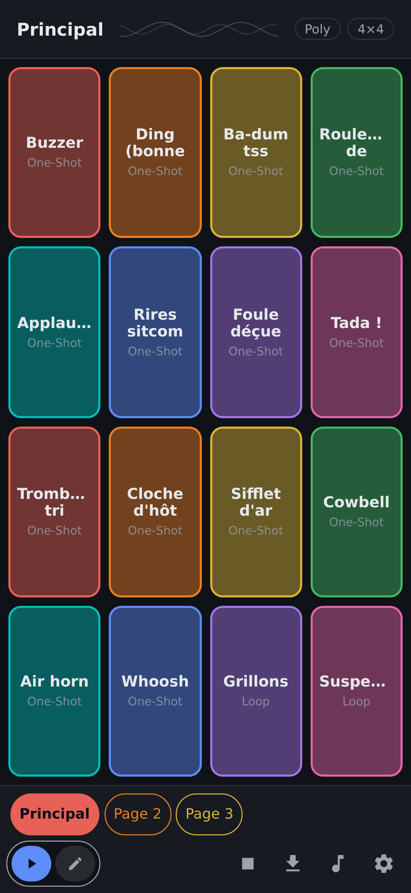
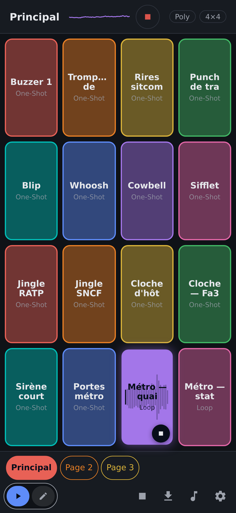
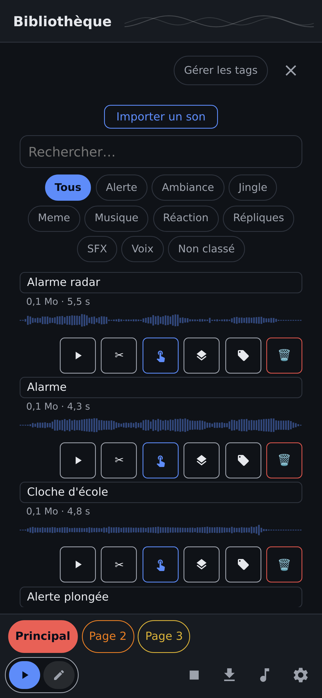

<!-- SPDX-License-Identifier: GPL-3.0-or-later -->
# Sampleboard

**Pads, sounds, zero friction.** Sampleboard is a **soundboard** app: a grid of pads that
trigger your sounds — reactions, jingles, ambiences — organized in pages. Import your audio
files, assign them, play. Built for live moments (streams, tabletop games, radio,
workshops), **fully offline**, and respectful of your data.

It is a *sampleboard*, **not a sampler**: deliberately simple — no effects, no complex
editing, just what you need to fire the right sound at the right time.

| The board | Playing | The library |
|---|---|---|
|  |  |  |

## Features

- **Pads in pages**: adjustable grid (up to 6×12), colors, multiple pages.
- **MIDI-controller-style play modes**: **One-Shot** (plays through), **Gate** (while
  pressed), **Loop** (until stopped); **Mono/Poly** polyphony per page.
- **Library**: import your audio files (multi-select, **zip/rar** archives), automatic
  OGG/Opus re-encoding, custom **tags**, search, preview.
- **Trim**: cut the start/end of a sound at import time or later (waveform, undo/redo) —
  the stored file is already trimmed.
- **Starter bank**: 25 soundboard classics (buzzer, laugh track, tada, sad trombone,
  applause…), all **CC0** from [Freesound](https://freesound.org) (full provenance in the
  bundled manifest).
- **Panic stop**, real-time visualizer, separate Edit and Play modes (no accidental
  triggers on stage).
- **Fully offline**: no network permission, no account, no telemetry — your sounds stay
  yours.

## Install

### Android (F-Droid) — *in preparation*

The **F-Droid** submission is being finalized (reproducible build, WASM compiled from
source, audited licenses). Until then, test APKs can be built from source (see
[`doc/`](./doc/)).

### Self-hosting with Docker — *coming with the web/PWA release (`0.11.0`)*

The **web/PWA** flavor (data persisted in your browser, installable, offline) will be
delivered as a static-server **Docker image** — also published on **Docker Hub**. The
intended usage:

```bash
# COMING SOON — the target command once the image is published:
docker run -d --name sampleboard -p 8080:80 fchaussin/sampleboard
# then open http://localhost:8080 and install the PWA from your browser
```

Track progress in the [roadmap](./roadmap.md) (milestone **M10 — Web distribution**).

## Your data

Everything is local: sounds and settings live on your device (SQLite on Android, browser
storage for the upcoming PWA). No network, no account, nothing leaves your machine.

## License

Code under **[GPL-3.0-or-later](./LICENSE)**. Starter-bank sounds: **CC0 1.0** (source and
author of each sound in `public/factory-samples/manifest.json`).

## Contributing & documentation

Developer documentation (Docker-based toolchain, architecture, tests, specs, roadmap)
lives in [`doc/`](./doc/), [`specifications.md`](./specifications.md) and
[`roadmap.md`](./roadmap.md).
